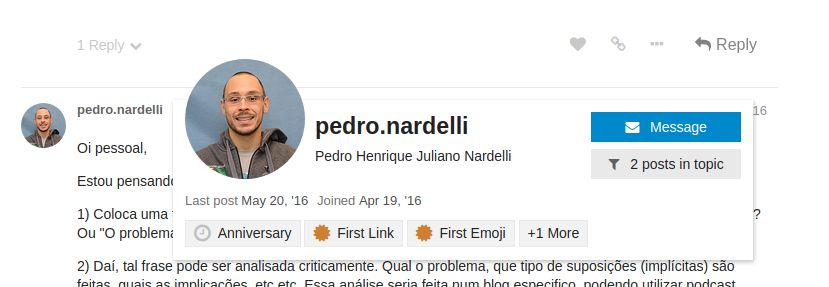
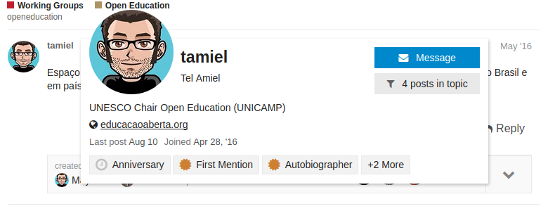
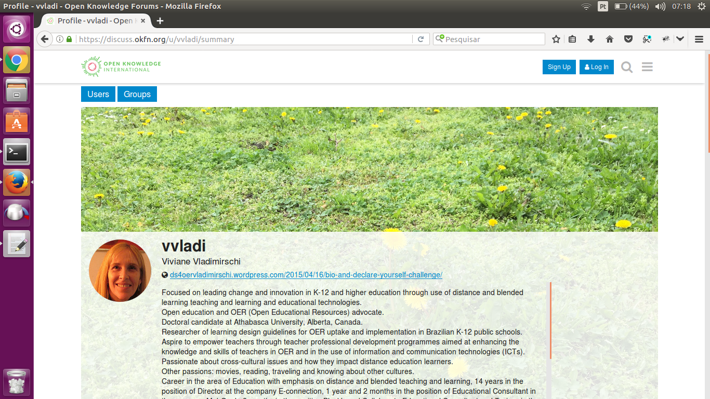

# Apresentando-se

Para participar mais efetivamente da comunidade, APRESENTE-SE!

1. Edite o seu perfil!

2. Apresente-se em inglês se estiver com disposição de participar em discussões gerais da OK.

3. Apresente-se nos grupos específicos para destacar seus interesses naquela área e já chamar atenção daquele grupo.

4. Faça um post mais geral dentro de um tópico do tipo "home".

## Edite seu perfil

Se não editar não tem problema, mas você não estará se apresentando quando as pessoas clicam no seu nome de usuário 

&nbsp;&nbsp;&nbsp;&nbsp;&nbsp;

Você pode se apresentar com apenas uma linha ou um link para sua home, 

&nbsp;&nbsp;&nbsp;&nbsp;&nbsp;

ou usar o formulário e o texto de apresentação de forma mais ampla, até com fotos.

&nbsp;&nbsp;&nbsp;&nbsp;&nbsp;

É como um resumo dos seus interesses e qualificações nas áreas de atuação da OKBR (dados abertos, transparência, etc.). Pode ser português, inglês ou bilígue.

## Apresente-se em tópicos onde queira interagir

Existem "tópicos genéricos" de discussão, que recebem a tag "home" para sinalizar que são a porta de entrada. Alguns exemplos:

* OK International, para apresentar-se à comunidade OK internacional (em inglês), http://discuss.ok.org.br/73

* Projeto Gastos Abertos, para apresentar-se à comunidade do projeto, http://discuss.ok.org.br/1359

* Educação Aberta, para postar sua discussão inicial, informes, etc. http://discuss.ok.org.br/2778

* Canal Medium OKBR, para discutir artigos do canal, http://discuss.ok.org.br/5849

Alguns são apenas para apresentações, outros são um ponto de partida, outros ainda são uma espécie de blog do assnto. 

