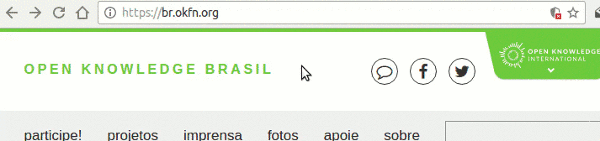
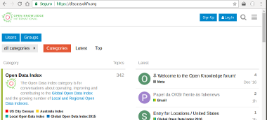
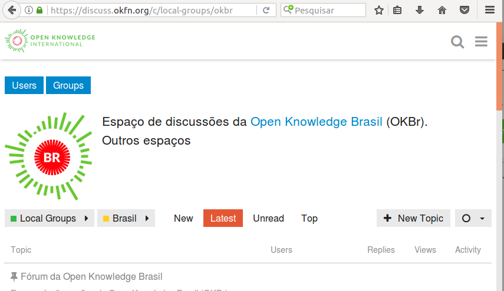
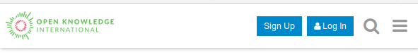
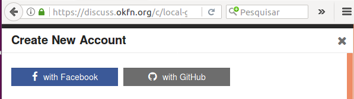
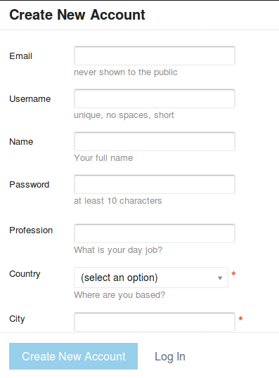
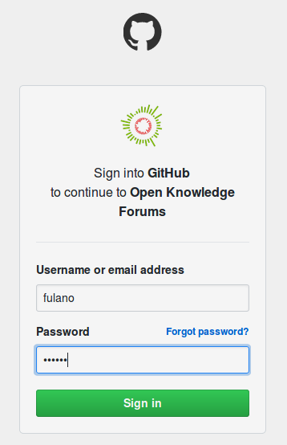
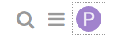
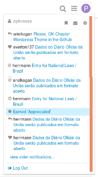
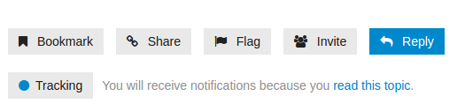

# Usando o DiscussOKBr

A OKBr oferece um espaço de discussão principal,
o [DiscussOKBr](https://discuss.okfn.org/c/local-groups/okbr),
organizado por assuntos (tópicos), e onde os participantes de cada discussão se
identificam e podem se expressar de forma mais rica e aprofundada,
fazendo uso de texto formatado, imagens, links, etc.

&nbsp;&nbsp;&nbsp;&nbsp;&nbsp; [discuss.okfn.org/c/local-groups/okbr](https://discuss.okfn.org/c/local-groups/okbr) = DiscussOKBr 
&nbsp;&nbsp;&nbsp;&nbsp;&nbsp; 

É um espaço dentro do internacional [Discuss.OKFN.org](https://discuss.okfn.org/),
onde escrevemos em português e os tópicos são relativos ao Brasil e à OKBr.
Qualquer pessoa pode se cadastrar e participar!
Não precisa ser associado da OKBR, nem preencher longos formulários.  

 
## Navegando até o DiscussOKBr

**Pelo site da OKBr:**

O site da OKBr apresenta em todas as páginas uma barra superior com
ícones, clique no primeiro, que é o ícone do DiscussOKBr.

&nbsp;&nbsp;&nbsp;&nbsp;&nbsp;

**Pelo próprio Discuss:**

O site geral de discussões da *Open Knowledge Nerwork* é o [discuss.okfn.org](http://discuss.okfn.org),
nele é só procurar pela categoria *Local Groups* e subcategoria *Brasil* (OKBr), ao descer um pouco na primeira página (ou depois de clicar no botão vermelho "Categories").

&nbsp;&nbsp;&nbsp;&nbsp;&nbsp;

## Primeiro passo

O DiscussOKBr abre sempre com essa página.

&nbsp;&nbsp;&nbsp;&nbsp;&nbsp;

### Grupo ou tópicos mais específicos

As discussões ativas e mais recentes  são listadas logo abaixo.

Caso não seja uma delas que procura, pode-se fazer uma busca, após clicar no  ícone  da lupa na barra superior.

## Primeira vez

Quando você navega pela primeira vez, ou navega sem estar logado,
aparecem na barra superior os botões “Sign Up” para se cadastrar, e “Log
In” para quem já se cadastrou indicar que quer entrar.

Como é a primeira vez, clique em “Sign Up”.

&nbsp;&nbsp;&nbsp;&nbsp;&nbsp;

### Cadastro automático

Se você já é usuário de plataformas como Facebook ou Github, pode se cadastrar automaticamente sem preencher cadastro algum e mantendo o esquema de autenticação da sua plataforma preferida.

&nbsp;&nbsp;&nbsp;&nbsp;&nbsp;

Neste caso basta escolher o botão desejada, apresentado logo no início, e pronto!

PS: é seguro, endossamos o processo e a equipe que mantém as bases de dados da OKFN em sigilo.

## Cadastro completo

Como opção ao cadastro automático, pode-se fazer uso do tradicional: são 9 ou 10 campos, com apenas 3 deles obrigatórios.

Ao final do preenchimento, clique em  “Create New Account”

&nbsp;&nbsp;&nbsp;&nbsp;&nbsp;

## Logando

Uma vez sendo cadastrado, pode usar o botão “Log In”.

&nbsp;&nbsp;&nbsp;&nbsp;&nbsp;

Vai abrir a janela ilustrada abaixo. São 3 opções, use a opção que adotou no cadastro:

1. Quem cadastrou via Github, só clicar no ícone do Github.

2. ... Google, só clicar no ícone do Google.

3. Quem cadastraou de forma independente, usar seu username e senha, depois clicar no "Log in".

Para os dois primeiros casos, se já estiver logado em outra aba, é automático. Caso contrário, vai aparecer uma tela de login com ícone da plataforma (na ilustração abaixo Github).

&nbsp;&nbsp;&nbsp;&nbsp;&nbsp;

## Navegando logado

Quando navegamos logados pelo DiscussOKBr, aparece no canto superior direito a sua foto ou um ícone com a sua inicial (ex. “P”).

&nbsp;&nbsp;&nbsp;&nbsp;&nbsp;

Clicando no seu ícone vão aparecer logo abaixo o seu username e três ícones (passe o mouse em cima),

-  Bookmaks (favoritos) 

-  Messages (correio interno) 

-  Preferences 

e ainda uma de avisos, no final o “Log Out” para sair.

&nbsp;&nbsp;&nbsp;&nbsp;&nbsp;

Uma vez logado, você pode participar (!), [veja como é fácil](participando.md).

## Outras dicas

Ainda logado, no final de cada tópico aparece, além do botão de "Reply", uma série de botões, conforme ilustrado abaixo. Passe o mouse devagar por cima para ver a descrição, ou mesmo clique em qualquer um deles (sem medo!).

&nbsp;&nbsp;&nbsp;&nbsp;&nbsp;

* "**Bookmark**": é um recurso interno de *favoritos*, para memorizar no seu login o que pretende ler mais tarde.

* "**Share**": permite você copiar e colar por exemplo no chat ou e-mail a URL (endereço internet) daquele tópico.

* "**Flag**": abre um formuário para você *notificar em sigilo* sobre algum tipo de problema com o post (propaganda, fora de tópico, etc.).

* "**Invite**": permite você copiar e colar por exemplo no chat ou e-mail a URL (endereço internet) daquele tópico.

* "**Tracking**": permite você copiar e colar por exemplo no chat ou e-mail a URL (endereço internet) daquele tópico.

Importante:  agora que logou, veja como [é fácil participar das discussões](participando.md).
